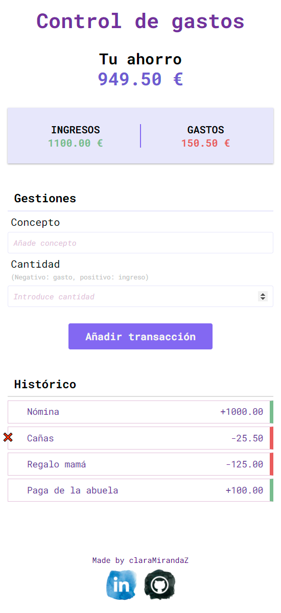

<h1 align=center>Práctica de JavaScript en el navegador</h1>

## Control de gastos

Necesitamos desarrollar una web que nos ayude a gestionar nuestros ingresos y gastos, con el objetivo de conocer el dinero que tenenos ahorrado.

## Vista previa

### Requisitos indispensables

1. La aplicación deberá mostrar en todo momento el total de gastos, ingresos y el dinero total que tenemos ahorrado.
2. Podremos añadir un ingreso o un gasto incluyendo un concepto.
3. Podremos borrar cualquier gasto o ingreso que hayamos introducido.

#### Requisitos opcionales

1. Si cerramos la web y volvemos a entrar, tenemos que recuperar todos los gastos e ingresos que habíamos introducido, así como el ahorro total.

Puedes ver el resultado final pinchando aquí ⤵️

